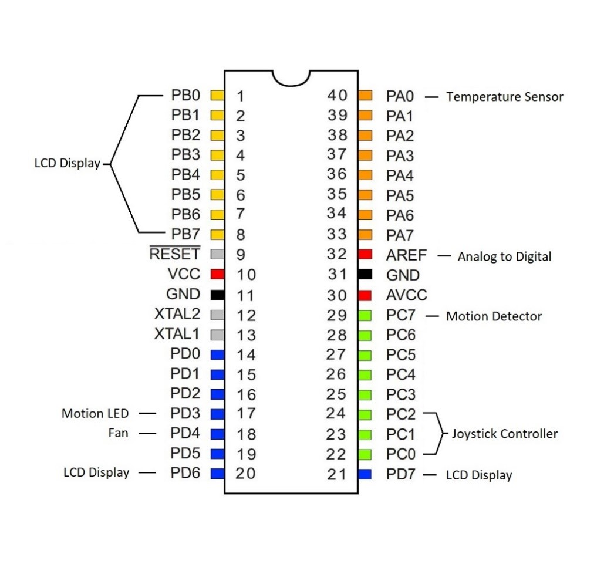

# Climate Control System Report

Name: Khuaja Shams

Full Demo link: [https://www.youtube.com/watch?v=0gW-LnDFG9E](https://www.youtube.com/watch?v=0gW-LnDFG9E)
- Temperature Sensor: [https://www.youtube.com/watch?v=CdVQmK8mKVk](https://www.youtube.com/watch?v=CdVQmK8mKVk)
- Joystick: [https://www.youtube.com/watch?v=HNJ8F4GzNvo](https://www.youtube.com/watch?v=HNJ8F4GzNvo)
- PIR Motion Sensor: [https://www.youtube.com/watch?v=kQT4YF7wqbU](https://www.youtube.com/watch?v=kQT4YF7wqbU)

## Project Description:

The climate control system is used to turn on a fan to until a desired temperature is detected. A temperature sensor detects the temperature of the room and displays it in Celsius. A PIR motion detector is also attached to the system so you can have the option to only have the fan on when there is movement detected in an environment. There is an LCD display with a menu that allows you to see the current temperature, set a desired temperature, and turn off the fan or motion detector. The user has a joystick that has x and y axis controls as well as a push selection control to browse and choose options on the display menu.

## User Guide:

Rules:

You are allowed to use the joystick to move up and down the menu items. You can select different menu items when the cursor is over the item. You can go back from a submenu into the main menu. You can select options to toggle on or off. You can toggle up or down the desired temperature. The desired temperature cannot go above 100 or below 0. The motion detector can detect movement up to 20 feet from it. The motion detector can stay on for another 2 seconds to 2 minutes (depending on analog settings) after motion has ceased to be detected.

Controls:

The joystick has vertical control to scroll up and down the main menu to with the cursor. Only one control type will be recognized by the microcontroller at a time. The select button of the joystick will choose a submenu to enter. The select button can also be used to select to put the fan and motion detector on or off when the cursor is hovering over each item. The joysticks horizontal control will allow you to go back from this menu into the main menu. In the temperature menu, the horizontal and vertical controls will be used to move the desired temperature down or up respectively. Pressing the select button will confirm the new desired temperature, put it into effect, and bring you back to the main menu.

Special Considerations:

The motion detector takes around 20 seconds to calibrate when first turning on the thermostat where the motion LED may light up even if no motion is detected.

## Source File Description:

- **File main.c** – Main file where the logic, input/output declarations, and state machines are.
- **File io.h** – LCD header file sourced from CS120B labs that declares functions used to write to screen.
- **File io.c** – LCD source file sourced from CS120B labs that defines functions used to write to screen.
- **File timer.h** – Header file sourced from CS120B labs that&#39;s used to define timer period.
- **Code for converting temperature sensor&#39;s analog signal into a Celsius obtained from manufacturer&#39;s datasheet:** [https://www.ti.com/lit/ds/symlink/lmt86.pdf?HQS=dis-dk-null-digikeymode-dsf-pf-null-wwe&amp;ts=1638874763637](https://www.ti.com/lit/ds/symlink/lmt86.pdf?HQS=dis-dk-null-digikeymode-dsf-pf-null-wwe&amp;ts=1638874763637)

## Component Visualization

## Task Diagram

## Technologies Learned

Learned how to solder circuit boards and pins together. I learned how to sync multiple synchronous state machines together to not overwrite each other&#39;s messages on a display. I learned how to convert the analog voltage of a temperature sensor into a readable Celsius temperature. I learned how to use a motion detector and manually adjusts its analog knobs for better detection. I learned how to configure a joystick to work with only one control being detected at a time.
